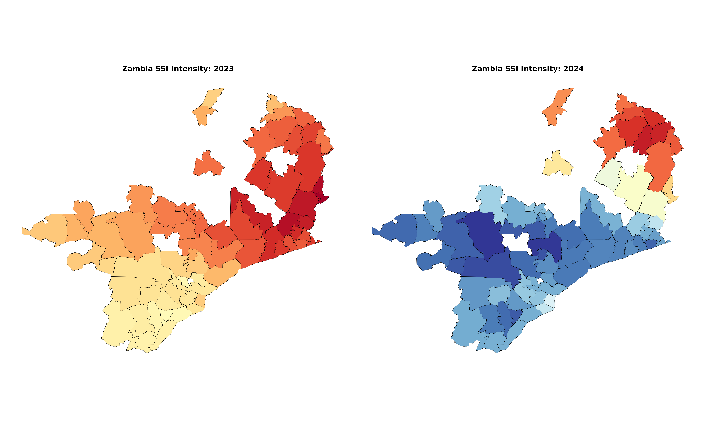

# Zambia Agricultural Drought Study: Spatiotemporal Analysis & Parametric Indices

This study implements a high-resolution analytical pipeline to quantify agricultural drought risk across Zambia. By transitioning from traditional rainfall monitoring to Root-Zone Soil Moisture anomalies, we provide a more accurate proxy for crop yield failure and parametric insurance design.

🌍 Study Area: Zambia
The analysis focuses on the administrative agricultural districts of Zambia. This region is characterized by high climate variability and a heavy reliance on rain-fed maize production. The Southern and Central provinces, in particular, serve as the "maize belt" but are increasingly vulnerable to the ENSO (El Niño Southern Oscillation) cycles, leading to devastating systemic shocks like the record-breaking drought of 2024.

💡 Importance of the Process
Traditional drought monitoring (like SPI) often ignores Evapotranspiration and Soil Water Retention. This process is critical for:
Reducing Basis Risk: Ensuring insurance payouts align with actual physical crop stress.
Capturing Flash Droughts: Using a daily Julian-day baseline (25-year history) allows us to identify rapid-onset moisture stress that monthly indices miss.
Parametric Insurance Triggers: Providing objective, satellite-derived "Strike Levels" (e.g., Count of Extreme Days) for automated financial disaster response.

🛠️ Tech Stack

     

📈 Key Results
1. Comparative Spatial Intensity (2023 vs 2024)
The map below demonstrates the dramatic shift from a relatively normal 2023 season to the severe systemic drought of 2024. The deep blue hues represent the cumulative intensity of the Standardized Soil Moisture Index (SSI) deficit during the critical January–April flowering window.

2. Historical Burn Analysis (2000–2025)
This interactive trend analysis plots the National Average against individual district performances. Peaks in the "Count of Extreme Days" (SSI < -1.0) highlight historical "Black Swan" events, essential for underwriters to calculate the Return Period of climate disasters.

(Open the generated Zambia_Drought_Frequency_Animation.html for the full interactive spatiotemporal pulse.)

📖 Scientific Methodology & References
The mathematical framework of this repository is built upon established climate science and agricultural economics:
Standardized Soil Moisture Index (SSI): Unlike rainfall, "soil moisture anomalies are more strongly correlated with crop yield fluctuations" (Carrão et al., 2016). This study utilizes a 25-year ERA5-Land climatology to calculate daily Z-scores.
Risk Window Filtering: Data is strictly filtered for January 1st to April 30th. This covers the vegetative and silking stages where water stress is most lethal to maize (Wang et al., 2024).
Systemic vs. Idiosyncratic Risk: By plotting district lines against the national mean, we identify Co-variance, a vital metric for international reinsurance and portfolio diversification (Barnett & Mahul, 2007).
Interactive Visualizations: Following Shneiderman’s (1996) "Visual Information-Seeking Mantra" (Overview first, zoom and filter, then details-on-demand), the Dash dashboard allows users to click specific geographic hotspots to reveal 25-year historical trends.
